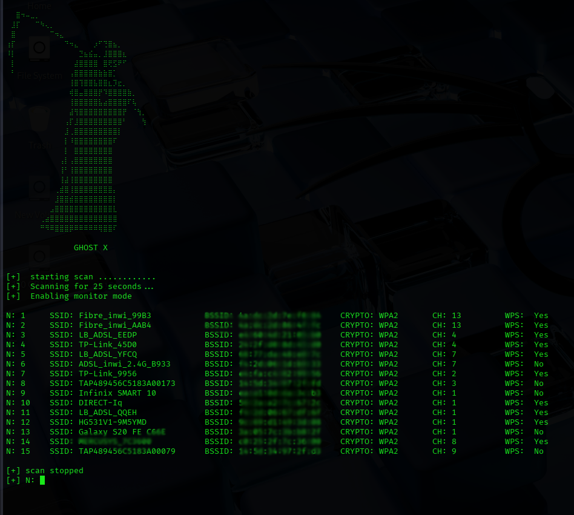
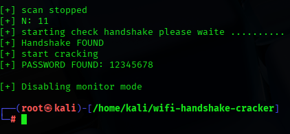

<h1 aling="left">GhostHnadshake</h1>
<h2 aling="left"> 📌 Description</h2>
  
 GhostHandshake is a tool designed to capture WPA/WPA2 handshakes and perform offline password cracking .

<h2 aling="left"> 📌 Features</h2>

- 📍 capture WPA/WPA2 handshake

- 📍 Detect connected clients

- 📍 Automatic deauthentication

- 📍 Offline passwoed cracking

<h2 aling="left"> 🌐 installation</h2>

<pre aling="left">
 git clone https://github.com/Mo3adSec/wifi-handshake-cracker.git
 cd wifi-handshake-cracker
 python3 GhostHandshake.py</pre>
<h2 aling="left"> 📸  screenshot</h2>

* ☠️ this images shows the tool while it is running ☠️

 ☠️ this is the result when the attack is successful ☠️

